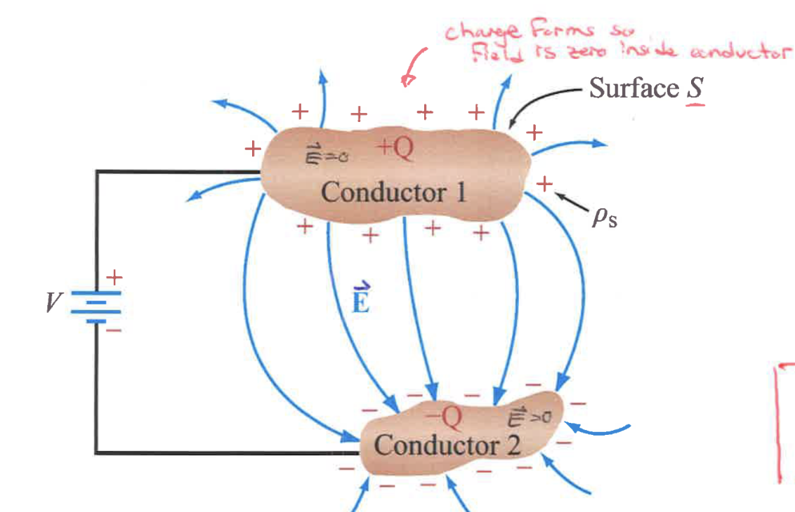
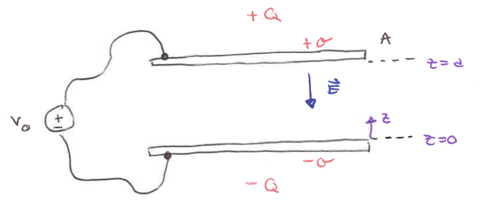

# Electrostatics

## Electrical Charge

**Definition**
* The source of an electrostatic field.
* The physical property of a material that causes it to experience a force when close to other electrically charged matters.
* Can be positive or negative.
* Unit: Coulomb (C).
* **Charge Conservation:** The Net charge is conserved just like energy cannot be created or destroyed.
* $e^- = -1.6*10^{-19} C$

**Coulomb's Law**

Force on $q_2$ from $q_1$ = 

$$\vec{F}_{21} = \frac{q_1 q_2}{4 \pi \epsilon_0 R_{12}^2} \hat{r}_{12}$$

,where $\hat{r}_{12}$ is the unit vector from charge $q_1$ to $q_2$.

* Magnitude is proportional to charges.
* Magnitude decreases with distance.
* $\epsilon_0 = 8.85 * 10^{-12} \frac{F}{m}$ is the permittivity of free space, and it has the unit $\frac{F}{m}$, which is the same as $C'$ from the transmission line.

## Electric Field
The vector that is equal in magnitude and direction to the force that would be exerted on a small test charge p carrying a charge of +1 from a charge with +q.

$$\vec{E}_p = \vec{F}_p = \frac{1}{4 \pi \epsilon_0} \frac{(+q) (+1)}{|\vec{R}|^2} \vec{r}_p$$

Why is it useful?

We can get the force by multiplying the E field by another charge $+q'$.

Given that we know $\vec{F}_p = \vec{E}_p (+q')$

Note: E field has the unit $\frac{N}{C}$. The +1 is unitless

**Electric Field From Multiple Charges**

Electric fields in a vacuum satisfy linear superposition.

The total field from multiple charges is the sum of fields from individual charges.

The sum of the N number of the E field at charge p:

$$\vec{E}_p = \frac{1}{4 \pi \epsilon_0} \sum_{i = 1}^{N} \frac{q_i}{|\vec{R} - \vec{R}_i|^2} \frac{\vec{R} - \vec{R}_i}{|\vec{R} - \vec{R}_i|}$$

## Charge Distribution

We characterize the charge distribution in terms of the **charge density**.

$Charge \space Density = \frac{Amount\space of\space Charge}{Unit\space of\space Space}$

**1D Line Charge Density**

$\rho_L = \frac{dq}{dl} \space (\frac{C}{m})$

$q = \int dq = \int \rho_L dl$

**2D Surface Charge Density**

$\rho_S = \frac{dq}{dA} \space (\frac{C}{m^2})$

$q = \int dq = \int \rho_S dA$

**3D Volume Charge Density**

$\rho_V = \frac{dq}{dV} \space (\frac{C}{m^3})$

$q = \int dq = \int \rho_V dV$

## Electric Field from a Charge Distribution

For a general distribution, we add up the contribution to the E field from each chunk of charge dq to point p.

$$\vec{E}_p = \int d\vec{E}_p$$

where $\vec{E}_p = \frac{dq}{4 \pi \epsilon_0 |\vec{R}|^2} \hat{R}$ and $\hat{R}$ is the vector pointing from dq to point p.

Given that we know the $\rho_V$ and $\vec{r_p} - \vec{r}$, the E field from a volume of charges is:

$$\int \frac{\rho_V(\vec{r}) dV}{4 \pi \epsilon_0 |\vec{r_p} - \vec{r}|^2} \frac{\vec{r_p} - \vec{r}}{|\vec{r_p} - \vec{r}|}$$

where $\vec{r_p} - \vec{r}$ is the vector subtraction between the position vector of the point $p$ and the chunk of volume in the integral. 

## Electric Scalar Potential

We want to solve the electrostatics problem with scalar quantity.

We know that the tiny work done along the path against the E field is $dV = -\vec{E} \cdot d\vec{l} = \frac{dW}{q}$

To move the charge from A to B, we need to do work. At point B, the charge has potential energy relative to point A: 

$$V_B - V_A = V_{AB} = \int_{A}^{B} dV = -\int_{A}^{B} \vec{E} \cdot d\vec{l} = \frac{Potential \space Energy}{Unit \space Charge} = \frac{J}{C}$$

Note that $\oint \vec{E} \cdot d\vec{l} = 0$ in a closed path.

### Potential From Point Charge

What's the electrostatic potential of a distance R from a point charge?

First, we want a reference point where there is no E field, which is at $R = \infty$

$$V(\vec{R}) = -\int_{A}^{B} \vec{E} \cdot d\vec{l} = -\int_{\infty}^{R} \frac{q}{4 \pi \epsilon_0 |\vec{R}'|^2}\hat{R}' \cdot \hat{R}' dR' = \frac{q}{4 \pi \epsilon_0 R}$$

### Potential From a Charge Distribution

The electrostatic potential at point p contributed by charge q is

$$dV_p = \frac{dq}{4 \pi \epsilon_0 |\vec{r}_p - \vec{r}|}$$

Now, the electrostatic potential from a volume charge density is:
$$V_p = \int dV_p = \int \frac{\rho_v(\vec{r})dV}{4 \pi \epsilon_0 |\vec{r}_p - \vec{r}|}$$

### Relationship to the E Field

$$\vec{E} = -\vec{\nabla} V$$

Force per charge = the negative of the change in potential per charge

## Gauss' Law

The amount of E field passes through a closed surface S

$$\oint_S \vec{E} \cdot d\vec{A} = \frac{Q}{\epsilon_0}$$

### Gauss' Law as a Tool
Applicable to the following symmetries:
* Spherical
* Cylindrical
* Planar

Steps
1. Identify symmetry in the field and write in simplified form.
2. Define S so that flux integral will be easy ($|\vec{E}|$ should be constant on S).
3. Evaluate the flux integral and enclosed charge.

## Conductors
* In a good conductor, under static conditions (electrostatics), the E field is 0 
* Since E = 0 in a good conductor, charges must reside on the surface.
* These surface charges will produce an E field normal to the surface, with $\vec{E_n} = \frac{\sigma}{\epsilon_0}\hat{n}$.
* Conductors in E fields: When a good conductor is placed in an electric field, the charges arrange themselves on the surface to cancel electric fields inside the conductor.

**Application**

* **Faraday Cage**: Suppose we have a hollow conductor with an empty cavity and we applied some fields outside of the conductor, what's the E field inside the cavity?
* If we do a line integral inside the conductor that partially overlaps the cavity, the integral must be 0. Since the E field in the conductor is 0, the E field in the cavity must be 0 for our result to sum to 0.

$$\oint_{cavity + conductor} \vec{E} \cdot d\vec{l} = \oint_{cavity} \vec{E}_{cavity} \cdot d\vec{l} + \oint_{conductor} \vec{E}_{conductor} \cdot d\vec{l} = 0$$
$$\vec{E}_{conductor} = 0 \implies \oint_{conductor} \vec{E}_{conductor} \cdot d\vec{l} = 0$$

Therefore, 

$$\oint_{cavity} \vec{E}_{cavity} \cdot d\vec{l} = 0 \implies \vec{E}_{cavity} = 0$$

**Takeaway:** There's zero electric field inside the conductor because of the cancellation from the induced field. Since $\vec{E} = -\vec{\nabla}V$ (E field is the derivative of V), this is why the voltage stays the same at the same node.

## Capacitance

In response to an electric field, a surface charge forms on the surface of a conductor.

In a conductor, $\vec{E}_n = \frac{\sigma}{\epsilon_0}\hat{n}$, so $Q = \int_s \epsilon_0 \vec{E} \cdot d\vec{A}$

And $V_{12} = -\int_{2}^{1} \vec{E} \cdot d\vec{l}$

$$C = \frac{Q}{V} = \frac{\int_s \epsilon_0 \vec{E} \cdot d\vec{A}}{-\int_{2}^{1} \vec{E} \cdot d\vec{l}}$$

$C = \frac{Q}{V}$

Capacitance depends on the geometry and the space between the conductors

**Example: The Capacitance of Parallel Plates**

$C_{parallel \space plate} = \epsilon_0 \frac{A}{d}$

$V_o = -\int \vec{E} \cdot d\vec{l} = -\int_{0}^{d} (-\frac{\sigma}{\epsilon_0}) \hat{z} \cdot \hat{z} dz = \frac{\sigma}{\epsilon_0}d$

$\sigma = \frac{Q}{A} \implies Q = A\sigma$

$C = \frac{Q}{V_o} = \frac{\epsilon_0 A\sigma}{d\sigma} = \epsilon_0\frac{A}{d}$

**Takeaway**: Capacitance is the ratio between charge and applied voltage. It depends on the space between the plates ($\epsilon$) and the geometry (A and d) of the plates.

## Dielectric Material
* In metals (good conductors), electrons are free and mobile.
* In insulators (dielectric) electrons are not free and mobile.
    * However, the outer electron could be pulled away and be modeled by an electric dipole with the proton.
    * The dipole produces E field pointing in the opposite direction as the initial E field.
    * This dipole field is approximately proportional to the E field in the case of a **linear dielectric**.
    * To find the E field inside a dielectric material, we must factor in the dipole field.

**Electric Flux Density**
$$\vec{D} = \epsilon_0\vec{E} + \vec{p}$$
$$\approx \epsilon \vec{E}$$
, where $\vec{E}$ is the applied E field, $\vec{p}$ is the dipole field, and $\epsilon$ is the permittivity.

Practically, we solve dielectric problems by replacing the permittivity of free space with the permittivity.

## Summary
Maxwell's Equation for Electrostatics
| Law | Integral Form | Differential Form |
|----| -----| -----|
| Gauss' Law | $\oint_s \vec{E} \cdot d\vec{A} = \frac{Q}{\epsilon_0}$ | $\vec{\nabla} \cdot \vec{E} = \frac{\rho(\vec{r})}{\epsilon_0}$ |
| Work Done | $\oint_c \vec{E} \cdot d\vec{l} = 0$ | $\vec{\nabla} \times \vec{E} = 0$ |

## Questions
* Can we apply Gauss' Law on a line or sheet that is not infinite in length?
* Why do we always assume an infinite sheet of **uniform** charge?
* What exactly is the Electric Flux Density