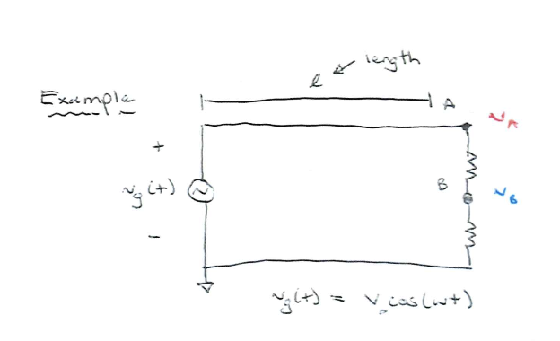
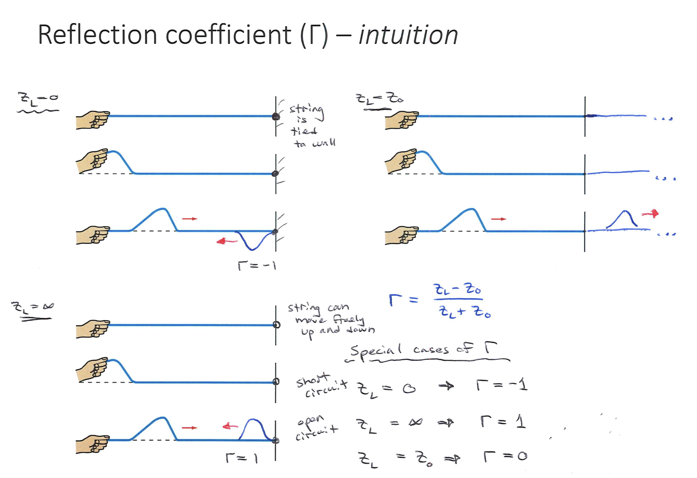

# Transmission Line

## Wave Basics
* **Waves are disturbances that propagate**
* However, the voltage waveform we observed in Circuit 1 doesn't take into account of the propagation of wave across physical space.

### Circuit Theory's Voltage Wave
$$V(t) = Acos(\omega t + \phi)$$
, where $A$ is the amplitude and $\phi$ is the phase.

### Physical 1-D Wave
$$
y(x, t) = Acos(\frac{2\pi}{T}t - \frac{2\pi}{\lambda}x+\phi) \\
= Acos(\omega t - \beta x + \phi)\\
$$

, where $A$ is the amplitude, $T$ is the period, $\lambda$ is the wavelength, and $\phi$ is the phase.

### Direction of the wave

Notice that if we fix $x$ and change $t$, we shift the wave across location.

$$
y(x, t) = Acos(\omega t - \beta x + \phi)\\
= Acos(-(\beta x - \omega t)) \\
= Acos(-\beta(x - \frac{\omega}{\beta}t))\\
$$

### Phase Velocity
Since the wave function is right shifted x unit by $\frac{\omega}{\beta}t$ 

after a time $\Delta t$,

$$
\Delta x = \frac{\omega}{\beta}\Delta t \\
v_p = \frac{\Delta x}{\Delta t} = \frac{\omega}{\beta} = \lambda f
$$

, where $v_p$ is the phase velocity.

## Lumped-Element Circuit Model
The Lumped-Element Circuit Model is not realistic as it assumes all observable electrical quantities changes instantaneously with the input.
For example, if you apply a sinusoidal input into the circuit, $V_A$ will reflect that immediately without delay.

So when to use it?

If $\frac{l}{\lambda} < \frac{1}{100}$, we can use the lumped-element model.

That's because the input voltage wave in the circuit can be modeled by the equation, 
$$v_g(t) = v_0cos(\omega t)$$

If there's delay, $t_d$, at the output, $v_A(t)$,

$$
v_A(t) = v_0cos(\omega (t - t_d)) \\
= v_0cos(\omega t - \omega t_d) \\
$$

As discussed in the wave basics, the time delay is the time it takes for the wave to travel to the location, 

$$
t_d = \frac{l}{v_p}, \\
= \frac{l}{\lambda f} \\
$$

Now,

$$
\omega t_d = 2\pi (\frac{l}{\lambda})
$$

Thus, if $\frac{l}{\lambda}$ is too small, the phase difference is small, so we don't need to account it and can use the usual circuit analysis technique. Vice versa.

We seee that we need to account for the phase shift if:
* $l$ is very large.
* $v_g(t)$ has a high frequency.

## Distributed Circuit

We need to account for spatial variation (Cannot use circuit 1's analysis) if $\frac{l}{\lambda} \geq \frac{1}{100}$

To analyze this big distributed circuit, we could partition the wire into small chunks, $\Delta z$.

Moreover, these $\Delta z$ won't just be wire. They are **coaxial cable** with resistance, inductance, and capacitance, so we need an accurate circuit to model it.

$$
\begin{align}
R' : resistance / length, \frac{\Omega}{m} \\
L' : inductance / length, \frac{H}{m} \\
G' : conductance / length, \frac{S}{m} \\
C' : capacitance / length, \frac{F}{m}
\end{align}
$$

### KVL

$$
\begin{align}
& v(z+\Delta z, t) = v(z, t) + v' \\
& = v(z, t) - i(z, t)R - L\frac{di(z, t)}{dt} \\
& \implies v(z + \Delta z, t) - v(z,t) = -R'\Delta z \space i(z, t) - L' \Delta z \frac{di(z, t)}{dt} \\ 
& \implies \frac{v(z + \Delta z, t)}{\Delta z} = -R' \space i(z,t) - L' \frac{di(z, t)}{dt} \\
\\
& \lim_{\Delta z \to 0}\frac{v(z + \Delta z, t)}{\Delta z} = -R' \space i(z,t) - L' \frac{di(z, t)}{dt} \\
& \implies \frac{\partial v(z, t)}{\partial z} = -R' \space i(z, t) - L'\frac{d i(z, t)}{d t}
\end{align}
$$

### KCL

$$
\begin{align}
& i(z, t) = i(z+\Delta z, t) + i' \\
& = i(z + \Delta z, t) + G'\Delta z \space v(z + \Delta z, t) + C'\Delta z \frac{d v(z + \Delta z, t)}{d t} \\
& = \frac{i(z + \Delta z) - i(z, t)}{\Delta z} = -G' \space v(z + \Delta z, t) - C' \frac{dv(z + \Delta z, t)}{dt} \\
\\
& \lim_{\Delta z \to 0} \frac{i(z + \Delta z) - i(z, t)}{\Delta z} = -G' \space v(z + \Delta z, t) - C' \frac{dv(z + \Delta z, t)}{dt} \\
& \implies \frac{\partial i(z, t)}{\partial z} = -G' \space v(z, t) - C' \frac{dv(z, t)}{dt} \\
\end{align}
$$

### Phasor Domain and the Helmholtz Equation
The results from KVL and KCL could be transformed into the phasor domain since $v(z,t)$ and $i(z, t)$ have periodic dependence on time.

$$\frac{d\vec{V}}{dz} = -R'\vec{I} - j\omega L' \vec{I}$$

$$\frac{d\vec{I}}{dz} = -G' \vec{V} - j\omega C' \vec{V}$$

However, we will assume the transmission line is **lossless**, meaning that $R'$ and $G' = 0$ and no energy is lossed during the transmission Thus, the phasor domain equations become:

$$\frac{d\vec{V}}{dz} = - j\omega L' \vec{I}$$

$$\frac{d\vec{I}}{dz} = - j\omega C' \vec{V}$$

If we manipulate the equations slightly, we'll find:

$$
\begin{align}
& \frac{d^2\vec{V}}{dz^2} = - j\omega L' \frac{d\vec{I}}{dz} \\
& \implies \frac{d^2\vec{V}}{dz^2} = (-j\omega L') (-j\omega C') \vec{V} \\
& \implies \frac{d^2\vec{V}}{dz^2} = -\omega ^ 2 L' C' \vec{V} \\
\end{align}
$$

This arrives at the **Helmholtz Equation (Telegrapher's Equation)**, where
$$\frac{d^2\vec{V}}{dz^2} + \beta^2 \vec{V} = 0$$ 

$$\frac{d^2\vec{I}}{dz^2} + \beta ^2\vec{I} = 0$$

and $\beta = \omega^2 L' C'$

**Solution**
* $\vec{V}_+(z) = V_0^+ e^{-j\beta z}$
* $\vec{V}_-(z) = V_0^- e^{j\beta z}$

In general:
$$\vec{V}(z) = V_0^+ e^{-j\beta z} + V_0^- e^{j\beta z}$$

**Physical Meaning of the Solution**

First transform the solutions into the time domain, which is:

$$v(z, t) = I_0^+ cos(\omega t - \beta z) + V_0^-cos(\omega t + \beta z)$$
$$i(z, t) = I_0^+ cos(\omega t - \beta z) + I_0^-cos(\omega t + \beta z)$$

This represents a traveling wave going to +z and -z direction with amplitude of $V_0^+$ and $V_0^-$.

These equations should apply to the part of the transmission line between sender and load, and it means that voltage varies between transmission lines. 

Also, $\beta = \omega \sqrt{L'C'}$, so the phase velocity of the waves are $v_p = \frac{\omega}{\beta} = \frac{1}{\sqrt{L'C'}}$.

### Characteristic Impedance $(Z_0)$

Could the $V_0^+$ and $I_0^+$ be related and same for the reflected wave?

We know

$$\frac{d\vec{V}}{dz} = - j\omega L' \vec{I}$$ 

If we plug in $\vec{V}$ and $\vec{I}$, 

$$\frac{d}{dz}(V_0^+ e^{-j\beta z} + V_0^- e^{j\beta z}) = -j\omega L' (I_0^+ e^{-j\beta z} + I_0^- e^{j\beta z})$$

$$ \implies V_0^+ = \sqrt{\frac{L'}{C'}}I_0^+$$

If we do the same for the backward traveling wave, we will get
$$V_0^- = -\sqrt{\frac{L'}{C'}}I_0^-$$

**Characteristic Impedance**

$$Z_0 = \sqrt{\frac{L'}{C'}}$$

It means that if we have a current wave, we always have a voltage wave related to the constant.
Moreover, the reverse current wave has a negative sign, signaling the current's direction is flipped.

### Reflection Coefficient
Are $V_0^+$ and $V_0^-$ related?

YES! They are related by $\gamma$, the reflection coefficient.

$\gamma = \frac{V_0^-}{V_0^+}$

We can find $\gamma$ by applying the boundary conditions about the load, which is $\vec{V}_L = Z_L \vec{I}_L$.

If we set the load at position $z = 0$,

we get

$$\vec{V}_L = Z_L \vec{I}_L$$

$$\implies \vec{V}(z = 0) = Z_L \vec{I}(Z = 0)$$

$$\implies \gamma = \frac{Z_L - Z_0}{Z_L + Z_0}$$

**Note:**
* If $Z_L == Z_0$, then $\gamma$ is 0. The wave perfectly transmits.
* If $Z_L == \infty$, then $\gamma$ is 1. The wave reflects with the same amplitude.
* If $Z_L == 0$, then $\gamma$ is -1. The wave reflects with opposite amplitude.

### Transmission Coefficient

$\tau = \frac{V_1^+}{V_0^+}$

### Standing Wave

**Refletion on a Trasmission Line**

If we manipulate the forward and backward traveling voltage wave, we'll find that:

$|V(d)| = |V_0^+|[(1 + |\gamma|^2 + 2|\gamma|cos(2\beta d + \theta_{\gamma}))]^{1/2}$

, where d represents the distance from the load to the generator.
**The amplitude varies with z (location).**

The first two terms of the amplitude correspond to the amplitude of the forward and backward wave, and the cosine term represents the interference.

**Destructive Interference**

When the cosine term is -1, 

$|V(z)| = |V_0^+| - |V_0^-|$

**Constructive Interference**

When the cosine term is 1,

$|V(z)| = |V_0^+| + |V_0^-|$

**Standing Wave Ratio**

$S = \frac{1 + |\gamma|}{1 - |\gamma|} = \frac{maxima}{minima}$, quantifies how much standing wave we have.

Period of the standing wave $= \frac{\lambda}{2}$

$d_{max} = \frac{n \lambda}{2} + \theta{\gamma} \frac{\lambda}{4 \pi}$

**Special Cases**
* Matched ($\gamma = 0$): no backward wave, no interference, no standing wave.
* Short ($\gamma = -1$): the backward wave has equal amplitude to that of the forward traveling wave.
* Open ($\gamma = 1$): the backward wave has equal amplitude to that of the forward traveling wave.

### Power

**Average Power** 

$P_{avg} = \frac{1}{2}Re[\vec{I}\vec{V}] = \frac{1}{2} Re[Z_{in}] |\vec{I}|^2$

Suppose we have the following voltage and current waves on the transmission line:

$\vec{V}(z) = V_0^+ (e^{-j\beta z} + \gamma e^{j\beta z})$

$\vec{I}(z) = \frac{V_0^+}{Z_0} (e^{-j\beta z} - \gamma e^{j\beta z})$

If we plug the voltage and current phasors into the average power equation, we get:

$P_{avg} = \frac{1}{2} Re[\frac{|V_0^+|^2}{Z_0}(1 - |\gamma|^2)] = \frac{|V_0^+|^2}{Z_0}(1 - |\gamma|^2)$

The first term represents the power carried by the incident wave, and the second term is the power carried by the reflected wave. 

Power is largest when $|\gamma| = 0$.
There's no power transmitting when $|\gamma| = 1$

### Wave Impedance $\gamma (d)$

We could turn the transmission line into a simple lumped impedance.

The second transmission line has characteristic impedance, $Z_1$

d is the length of the transmission line.

$z(d) = \frac{\vec{V}(z = d)}{\vec{I}(z = d)} = \frac{V_0^+ (e^{-j\beta z} + \gamma e^{j\beta z})}{\frac{V_0^+}{Z_1} (e^{-j\beta z} - \gamma e^{j\beta z})} = Z_1 (\frac{1+\gamma e^{-2j\beta d}}{1 - \gamma e^{-2j\beta d}})$

$z(d) = Z_1 (\frac{Z_L + jZ_1 tan(\beta d)}{Z_1 + jZ_Ltan(\beta d)})$

**Inductive and Capacitive Impedance**

A transmission line could behave as an inductor or capacitor depending on the lumped impedance it has.

### Smith Chart
* Graphical tool to relate $Z_0, \gamma, Z_L$.

* Based on Normalize load impedance: $\gamma = \frac{\bar{Z}_L - 1}{\bar{Z}_L + 1}$

* $\gamma_{real}$ is the horizontal axis, and $\gamma_{imaginary}$ is the vertical axis.

* The group of circles lying on the horizontal axis is the real part of the $\bar{Z}_L$, and the top and bottom curves represent its imaginary part.

* The chart is bounded by $|\gamma| = 1$, which means $|\gamma| < 1$ in the smith chart. This is because the transmission line cannot reflect more than it sends in.

* A matched load should have a reflection coefficient at the center so that $\bar{Z}_L = 1$, thus $\gamma = \bar{Z}_L - 1 = 0$.

* Rotating a point **clockwise** in the Smith Chart corresponds to extending the transmission line **from the load to the generator**.

* Rotation by 180 degrees around the origin turns impedance to admittance.

**Equations of the Circles in Smith Chart**

We can put the normalized load impedance as a complex impedance
$$Z_L' = r_L + jx_L = \frac{1-\gamma_r ^ 2 - \gamma_i ^2 + 2j\gamma_i}{(1-\gamma_r)^2+ \gamma_i ^ 2}$$

$$r_L = \frac{1 - \gamma^2 _r - \gamma^2 _i}{(1-\gamma_r)^2+ \gamma_i ^ 2}$$

$$x_L = \frac{2\gamma_i}{(1-\gamma_r)^2+ \gamma_i ^ 2}$$

**Real Part Circles**

After manipulating $r_L$, we arrive at: 

$$(\gamma_r - \frac{r_L}{1 + r_L})^2 + \gamma_i ^ 2 = (\frac{1}{1 + r_L})^2$$

As $r_L$ increases, the circle shifts right and the radius decreases.

**Imaginary Part Circles**

After manipulating $r_L$, we get: 

$$(\gamma_r - 1)^2 + (\gamma_i - \frac{1}{x_L})^2 = (\frac{1}{x_L})^2$$

**Why Rotation Corresponds to Extending the Transmission Line?**

Recall that $$Z_L = \frac{Z_L - Z_0}{Z_L + Z_0} \implies Z_L = Z_0 \left( \frac{1 + \gamma}{1 - \gamma} \right)$$, with $Z_L$ as the load impedance and $Z_0$ as the characteristic impedance.

On a transmission line with $d = 0$ located at the load, it can be shown that the input impedance at any point l to the left of the load is 

$$Z(d) = \frac{\vec{V}(-d)}{\vec{I}(-d)} = Z_0 \left( \frac{1 + \gamma e^{-2j \beta d}}{1 - \gamma e^{-2 j \beta d}} \right)$$

We observe that when $d = 0$, $Z(d)$ is precisely $Z_L$. As we move to a larger d (traveling from load to generator), $\gamma$ is multiplied by a phase $e^{-2j\beta d}$.

*Therefore, traveling from load to generator will result in *clockwise* rotation in the Smith Chart since the coordinate of the Smith Chart is based on $\gamma$

**Lumped Element Impedance Matching**

We will design networks to match $Z_L$ to $Z_0$ to maximize power transmission.

We want $Z_{in} = R_{in} + j X_{in} = Z_0$

Objective of matching: $\bar{Z}_{in} = 1 + j0$

which is also $\bar{Y}_{in}$ = \frac{1}{\bar{Z}_{in}}$

Recall that we can add admittances, $\bar{Y}_{in} = \bar{g}_{in} + j \bar{b}_{in}$, when elements are in parallel.

**Steps**

**Objective of matching:** $\bar{Z}_{in}(d) = 1 + j 0$

Note: Be aware of normalized and unnormalized quantities. 

$Y_{in} = \frac{Z_0}{\bar{Z}_{in}} = \frac{Z_0}{\bar{Y}_{in}}$

|Steps|Instruction|Explanation|
|----:|-----------|-----------|
|1|Plot $\bar{Z}_L$ and convert to $\bar{Y}_L$| We are adding an element in parallel, effectively adding admittance of the element and the transmission line after it.
|2|Adjust the element position (rotate through Smith Chart) so that $\bar{Y}_L(d) = 1 + j B_{in}$. Rotate until we are at the $\bar{g}_{L} = 1$ circle.|Rotation corresponds to adding length, d, between the element and the load. We want a length such that $\bar{Y}_L(d) = 1 + jB_{in}$
|3|Choose the value of the element, $X$, to eliminate $j B_{in}$. Read off $\bar{B}_{in}$ value and choose the appropriate element and value to cancel it. | $\bar{Y}_{in} = \bar{Y}_{Element} + \bar{Y}_L = jX + (1 + jB_{in}) = 1$ 

**Single-Stub Matching**

Adding a capacitor or inductor in parallel may not always be feasible.

However, we've learned that a short-circuit transmission line could have a complex impedance.

|Steps|Instruction|Explanation|
|----:|-----------|-----------|
|1| Follow the lumped element matching step 1 to 2 | We want to know the value of $B_{in}$ that the short-circuit line needs to cancel.
|2| Find the point with $-B_{in}$, and lies on the $g_L = 0$ circle | We want the short-circuit stub to have the negative of the $B_{in}$, so the imaginary parts cancel when placed in parallel.
|3| Start from the short circuit admittance position (1 + j0) and move the line to the line found in step 2. Calculate the length difference in terms of $\lambda$. This would be the **stub length**. | We found how long the stub needs to have an imaginary impedance that cancels that of the transmission line on the right. Remember, the short circuit line has no real impedance/admittance, so we just need to move it to the $-B_{in}$