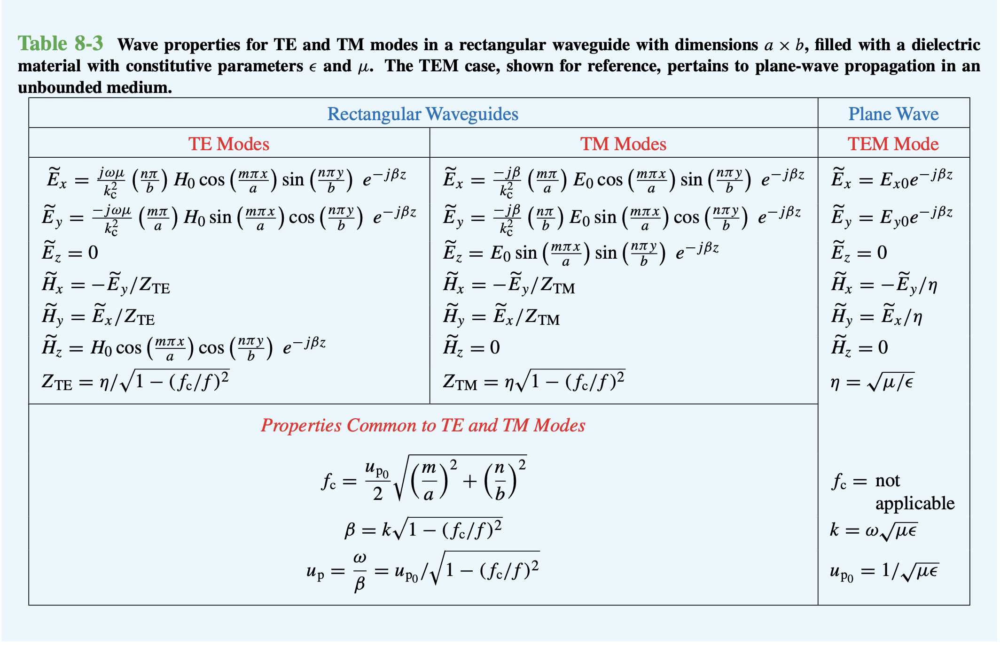

# Waveguides

This chapter derives the EM wave solution traveling in parallel plate and rectangular waveguides and their dispersion relations. Waveguide can guide the EM wave in the direction that the application wants. 

For example, in a microwave oven, we want the EM wave to be guided to the food chamber to vibrate the water molecules in the food, which heat the food.

## 1. Parallel Plate Waveguides

If we have an EM wave incident on a perfect conductor, $\Gamma = -1$ regardless of the incident angle.

Therefore, we can use two metallic plates to build a waveguide that guides the direction of the wave.

Depending on the polarization of the electric field, there will be different solutions to wave in the waveguide.

### Transverse Electric (TE) Mode

Consider a plane wave reflecting from the bottom conductor of a parallel-plate waveguide. The plane wave is perpendicularly polarized - its component is perpendicular to the direction of propagation.

The total wave is

$$\mathbf{\widetilde{E}}(x, z) = \mathbf{\widetilde{E}_i} + \mathbf{\widetilde{E}_r}$$

$$= \hat{y} E_0 ^i e^{-j(-k_x x + k_z z)} + \hat{y} \Gamma E_0 ^i e^{-j(k_x x + k_z z)}$$

$$= \hat{y} E_0 ^i (e^{j(k_x x)} - e^{-j(k_x x)}) e^{-jk_z z}$$

Using Euler's Identity

$$= \hat{y} E_0 ^i (2 j \sin(k_x x))e^{-jk_z z}$$

If the distance between the metallic plates is d, $\sin(k_x x) = 0$ because the perpendicular E field must be 0 at the boundary, so $k_x d = m \pi$ 

The electric field phasor of EM wave traveling toward z inside a perfectly conducting waveguide becomes:

$$\bold{\widetilde{E}}(x, z) = \hat{y} E_{0}^i \sin \Big(\frac{\pi m}{d} x \Big) e^{- j k_z z}$$

where m is any positive integer.

Notice that if we fix z, we have a standing wave across x. If we fix x, we have a wave traveling toward +z.

The phasor forms a grid-like pattern moving toward +z. When two metallic plate waveguides are placed at the axis, the wave doesn't exist outside of the waveguide. 

### Transverse Magnetic (TM) Mode

The magnetic field is perpendicular to the plane of propagation and the E field is in parallel to it. The TM Mode has a similar wave solution to that of the TE mode, and the dispersion relation is identical.

$$\bold{\widetilde{E}}(x, z) = \frac{-j H_0}{\omega \epsilon}\Bigg(-\hat{z} \frac{m \pi}{d} \sin\Big(\frac{m \pi}{d}x\Big) + \hat{x} j k_z \cos\Big(\frac{m \pi}{d}x\Big)\Bigg)e^{-j k_z z}$$

where m is any positive integer, including 0.

At m = 0,

$$\bold{\widetilde{E}}(x, z) = \hat{x} \eta H_0 e^{-j k_z z}$$

The m = 0 solution is special such that it only exists for TM mode because TM mode is related to cosine, which is not zero at m = 0.

### Dispersion Relation

The dispersion relations relates the propagation constant, $k$, and the operating frequency of the wave, $\omega$

$$k_x ^2 + k_y ^2 + k_z ^2 = \epsilon \mu_0 \omega ^2$$

$$\Big(\frac{m \pi}{d}\Big)^2 + k_z ^2 = \epsilon \mu_0 \omega^2$$

We can rearrange the equation above into:

$$k_z = \sqrt{\mu_0 \epsilon \omega^2 - \Big(\frac{m \pi}{d}\Big)^2}$$

### Cut-Off Frequency

The cut-off frequency occurs when $k_z = 0$

$$\omega_{cm} = \frac{1}{\sqrt{\mu \epsilon}} \frac{m \pi}{d}$$

* Attenuation: $\mu_0 \epsilon \omega^2 < (\frac{m \pi}{d})^2$ means $k_z$ is imaginary and there's loss.
* The single mode regime must be between $\omega_{c1}$ and $\omega_{c2}$.
* If transmit an EM wave of frequency $\omega$ and want it to propagate in mode $m$ without loss, $\omega$ should be larger than the cut-off frequency of $m$ so that $k_z$ is not a complex number that introduces loss to the wave.

## 2. Rectangular Waveguides

The parallel-plate waveguide is not realistic because it's infinite in one dimension. Therefore, we will look at the rectangular waveguides, where the wave is confined in the x and y directions.

$$k_c ^2= k_x ^2 + k_y ^2$$

**Dispersion Relation**

$$\Big(\frac{m \pi}{a}\Big)^2 + \Big(\frac{n \pi}{b}\Big)^2 + k_z ^2 = \epsilon \mu \omega^2$$

### Cut-Off Frequency

When $k_z = 0,$

$$\omega_{cut-off \space m, n} = \frac{1}{\sqrt{\mu \epsilon}} \sqrt{\Big(\frac{m \pi}{a}\Big)^2 + \Big(\frac{n \pi}{b}\Big)^2}$$

## 3. Dielectric Slab Waveguide

### Surface Wave from Total Internal Reflection

The transmitted surface wave has a phase shift and decays.

Consider a reflection problem where $\sin(\theta_t) > 1$ 

The transmitted wave's wave vector is

$$\vec{k}_t = \vec{k}_x \hat{x} + \vec{k}_z \hat{z}$$

$$= |\vec{k}|(\sin(\theta_t) \hat{x} + \cos(\theta_t)\hat{z})$$

Since $\cos(\theta_t) = \sqrt{1 - \sin^2(\theta_t)}$ and $\sin(\theta_t) > 1$, $\cos(\theta_t) = -j a_z$

$$\vec{k}_t = k_x \hat{x} + -j a \hat{z}$$

As a result, the wave will look like $e^{- j k_x x - a z}$, which has a decaying factor

Furthermore, we will find that

$$\bold{\Gamma = 1}$$

which makes the dielectric interface similar to that of a perfect conductor and makes it a good waveguide.

### Waveguide Solutions

For this waveguide to work, $\epsilon_1 > \epsilon_2$ because the total internal reflection occurs when $\sin(\theta_t) = \frac{n_1}{n_2} \sin(\theta_i)$

$\bold{\widetilde{E}}$ in $\epsilon_1$

$$\bold{\widetilde{E}} = \hat{y} E_0 ^ i e^{-j(-k_x x + k_z z)} + \hat{y} \Gamma E_0 ^ i e^{-j (k_x x + k_z z)}$$

$\bold{\widetilde{E}}$ in $\epsilon_2$

$$\bold{\widetilde{E}} = \hat{y} \tau E_0 ^ i e^{-j (j a_x x + k_z z)}$$

### Cut-Off Frequency

The cut-off frequency of the dielectric slab waveguide:

$$\omega_{c} = \frac{(m-1) \pi}{2d} \frac{1}{\sqrt{\mu_0 (\epsilon_1 - \epsilon_2)}}$$

